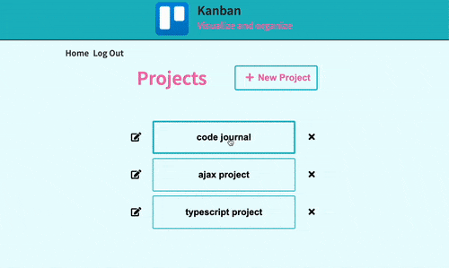
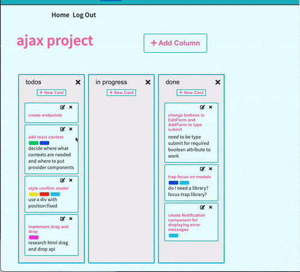

# ProjectMap

ProjectMap is a full stack web application for developers who want to visualize and organize their projects. The app is inspired by kanban boards used in agile development methodologies.

## Live Site

ProjectMap allows users to map out a complex project by dividing it into small tasks, move tasks from column to column on the project board to mark their progress, and keep tasks organized with color-coded labels.

Try ProjectMap [here](https://project-map-123.herokuapp.com/)!

## Technologies Used

- React.js
- Express.js
- Node.js
- PostgresSQL
- HTML5
- CSS3
- Webpack
- Heroku

## Features

- User can create and delete project boards.
- User can add and delete columns from project boards.
- User create, delete, and edit task cards.
- User can add and remove color-coded labels from cards
- User can drag and drop to reorder task cards within a column;
- User can drag and drop to move a task card between columns.
## Preview





## Planned Features

- build out user registration and authentication
- allow users to authenticate through Github's OAuth implementation.

## Development

### System Requirements

- Node.js 10 or higher
- NPM 6 or higher
- PostgreSQL 12 or higher

### Getting Started

1. Clone the repository.

 ```shell
    git clone https://github.com/yunyunliu/project-map.git
    cd project-map
  ```
2. Install all dependencies with NPM.

 ```shell
    npm install
 ```

3. Import the example database to PostgreSQL.

 ```shell
    npm run db:import
 ```

4. Start the project. Once started you can view the application by opening http://localhost:3000 in your browser.

  ```shell
    npm run dev
  ```
