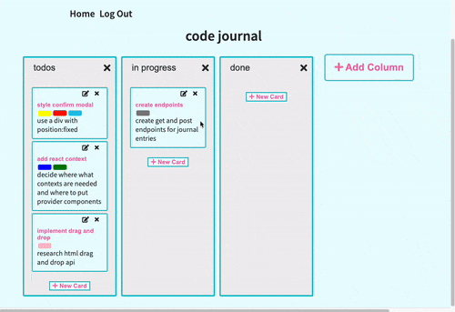

# TaskMap

 TaskMap is a full stack project board application for developers who want to visualize and organize their projects. It is by the kanban board used in agile development methodologies.

## Live Site

Use TaskMap to break up a larger project into small tasks and keep track of task progress.

Try TaskMap [here](https://project-board-345.herokuapp.com/)!

## Technologies Used

- React.js
- Express.js
- Node.js
- PostgresSQL
- HTML5
- CSS3
- Webpack
- Heroku

## Features

- User can create and delete project boards.
- User can add and delete columns from project boards.
- User create, delete, and edit task cards.
- User can add and remove color-coded labels from cards
- User can move task cards between columns.

## Preview

## Planned Features

- add drag and drop functionality to task cards
- allow users to authenticate through Github's OAuth implementation.
